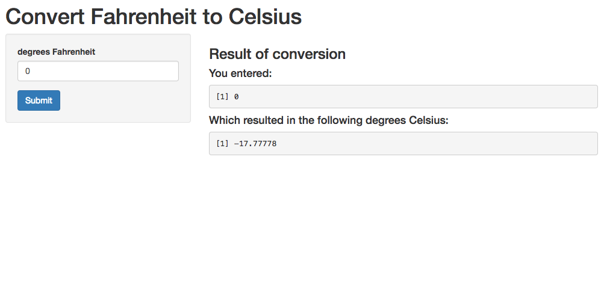

Course Project: Converting Fahrenheit to Celcius (Shiny Application)
========================================================
author: Viraj Bhalala
date: Jan 1, 2018
autosize: true

Project Description
========================================================

I based my project off of the example diabetes prediction algorithm project discussed in class.
However, instead of predicting diabetes, I decided to use the formula for converting temperatures from Fahrenheit
to Celsius. C = (F - 32) * (5/9). Everything else, the structure, and layout, remains the same.


Slide With Code
========================================================
Here is a sample of the code for temperature conversion. In the example, we begin with a temperature of
32 degrees Fahrenheit. This is the freezing point, and we might already recognize that we should receive
a value of 0 degrees Celcius after the conversion formula is applied - and we do!

```r
t <- 32 # 32 degrees fahrenheit
celsius <- function(fahrenheit) (fahrenheit - 32) * (5/9) # conversion formula
celsius(t)
```

```
[1] 0
```

UI Screenshot
========================================================



To access and play around with the Shiny Application, please visit <https://jonchang03.shinyapps.io/courseproject/>

Thank You
========================================================
